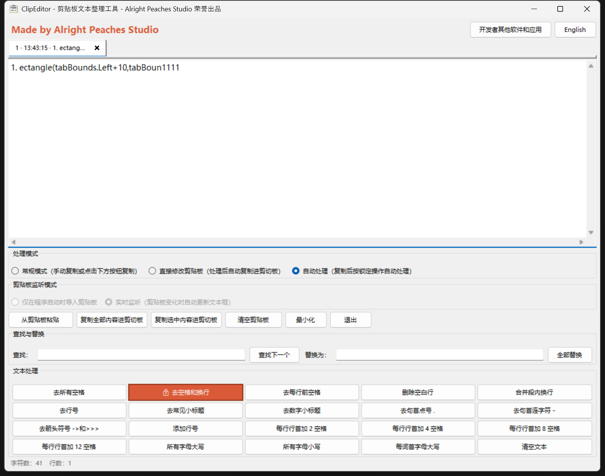
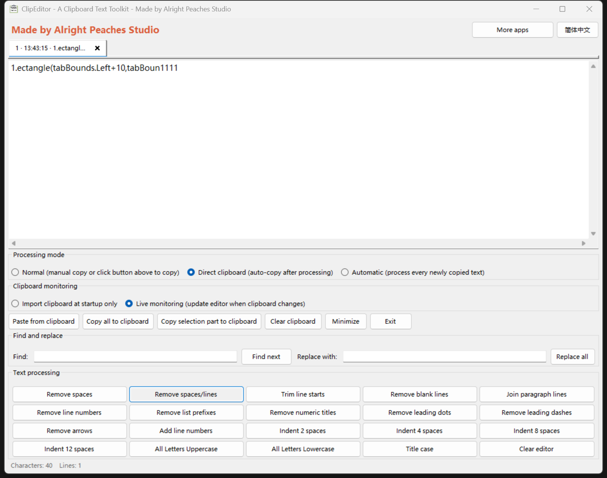

# ClipEditor



**Windows 剪贴板文本预处理工具 · A Windows Clipboard Text Preprocessor**

Made by **Alright Peaches Studio**

[简体中文](#简体中文) · [English](#english)

## 简体中文

### 软件简介

ClipEditor 是使用 C# 和 Windows Forms 开发的 Windows 桌面工具，主要用于在粘贴之前，对剪贴板中的文本进行纯文本提取、编辑和预处理。

从 Word、PDF、ChatGPT 网页或其他网站复制内容时，剪贴板中往往同时包含文字和富文本格式。直接粘贴到其他应用中，可能会带入不需要的字体、字号、颜色、背景或其他样式。ClipEditor 读取其中的文本内容，让你先检查和整理，再将结果以纯文本形式复制回剪贴板，方便粘贴到目标应用中。

除了去除富文本样式，ClipEditor 还提供缩进、空格与换行整理、列表前缀清理、查找替换及临时历史标签等功能，减少逐行修改和反复复制粘贴的工作量。

例如，你从 ChatGPT 复制了一段代码，需要将它嵌入现有代码块，并在每行前额外增加四个空格。与其逐行手动输入，只需将内容载入 ClipEditor，点击“每行行首加 4 空格”，再复制结果即可。

> 纯文本提取去除的是剪贴板中的富文本样式，不会自动删除文字本身包含的 Markdown 标记，例如 `**`、`#` 或代码围栏，也不会自动检查代码语法。

### 主要功能与适用场景

#### 1. 富文本转为纯文本

**设计初衷：让复制来的内容适应目标应用，而不是把来源应用的样式一起带过去。**

适合以下场景：

- 从 Word 复制段落，但不希望带入原文的字体、字号、颜色或背景。
- 从 ChatGPT 网页复制回答，需要将文字粘贴到自己的文档、表单或编辑器中。
- 从多个网站收集资料，希望最终内容采用目标文档统一的样式。
- 复制代码或配置片段，只需要文本，不需要网页的显示格式。

将内容导入 ClipEditor 后，点击“复制全部内容”或“复制选中内容”，即可将文本重新写入剪贴板。纯文本粘贴后的外观仍由目标应用决定。

仅导入内容，不会自动把系统剪贴板改写为纯文本；需要主动复制，或在直接修改剪贴板模式下执行处理操作。

#### 2. 可编辑文本框与内容统计

**设计初衷：在正式粘贴前，提供一个可以检查和手动修订内容的中间区域。**

可以直接新增文字、删除多余内容、修改代码或调整段落，而不必先打开另一款编辑器。

字符数和行数统计有助于检查内容长度，例如确认文字是否满足表单的字符限制，或比较整理换行前后的文本结构。

主文本框不设置固定的字符数量上限，但实际容量和响应速度仍受内存、文本长度及历史标签数量影响。

#### 3. 剪贴板操作

| 功能 | 设计初衷与典型场景 |
| --- | --- |
| 从剪贴板导入 | 按自己的节奏读取下一段内容。适合关闭实时监听后，避免外部复制操作打断编辑。 |
| 复制全部内容 | 将完整结果以纯文本形式写入剪贴板。适合把整理完成的回答、文档或代码一次性粘贴到目标位置。 |
| 复制选中内容 | 只复制当前选中的文字。适合从 ChatGPT 的长回答中提取一个段落、几句话或一段代码。 |
| 清空剪贴板 | 主动移除当前系统剪贴板内容，减少后续误粘贴的可能。它不等于安全擦除，也不保证清除 Windows 剪贴板历史。 |

#### 4. 空格与换行整理

| 功能 | 设计初衷与典型场景 |
| --- | --- |
| 去所有空格 | 批量移除普通空格。适合整理夹杂多余空格的编号、标识符或短字符串。 |
| 去空格和换行 | 将分散在多行中的内容拼接成连续字符串，减少逐行合并的工作。 |
| 去每行前空格 | 清理复制内容中不需要的行首空白，让文本重新对齐，或为后续添加统一缩进做准备。 |
| 删除空白行 | 清除复制后出现的多余空行，减少无意义的垂直间距。 |
| 合并段内换行 | 将复制后被拆成多行的段落重新连接，使用空白行区分段落。 |

注意：

- “去所有空格”针对普通空格，不应理解为删除所有 Unicode 空白字符。
- 空格和空行可能属于正文结构或代码语法，不应不加检查地删除。
- 对 Python 等依赖缩进的代码，去掉行首空白可能破坏代码结构。
- 合并段内换行不会自动理解文章或代码，应检查处理结果。

#### 5. 列表前缀与符号清理

**设计初衷：清理复制展示内容时一起带来的编号、前缀和提示符，保留真正需要的正文。**

| 功能 | 典型场景与范围 |
| --- | --- |
| 去行号 | 复制出的文本或代码带有受支持的行号形式，而目标位置只需要正文。 |
| 去常见小标题或列表前缀 | ChatGPT 回答或文档以括号编号等常见前缀组织，需要减少逐条删除前缀的工作。 |
| 去数字小标题 | 批量清理程序支持的数字小标题形式。 |
| 去句首点号 | 各行开头出现不需要的点号，需要统一清理。 |
| 去句首连字符 | 将以连字符开头的列表转换为不带该标记的文本。 |
| 去箭头符号 | 不需要示意关系或提示符中的 `->`、`>>>` 等受支持符号，只希望保留文字。 |

这些功能只处理程序支持的形式，不是通用语法分析器。“小标题”不表示能够自动识别和删除所有自然语言标题。

连字符可能属于负数或命令参数，箭头符号也可能是有效代码。处理代码和重要数据前，请保留原始副本。

#### 6. 行号与字母大小写转换

| 功能 | 设计初衷与典型场景 |
| --- | --- |
| 添加行号 | 在讨论、审阅或教学中引用具体某一行，让别人更容易定位内容。 |
| 所有字母大写 | 按目标格式要求统一字母大小写，例如整理标签或短文本。 |
| 所有字母小写 | 批量统一为小写，减少逐个修改的工作。 |
| 每词首字母大写 | 对英文标题、名称或短语进行快速的词首字母大小写转换。 |

大小写转换不会判断品牌写法、缩写或标题语法。代码、网址、密码及其他区分大小写的内容不应随意转换。

#### 7. 行首增加 2、4、8 或 12 个空格

**设计初衷：快速调整整段文本的嵌入层级，避免逐行手动增加缩进。**

典型场景包括：

- 从 ChatGPT 复制代码后，将整段代码放入现有函数或代码块。
- 让复制来的内容整体向右额外缩进四个空格。
- 编写 Markdown 文档时，为一段文本增加缩进。
- 将说明、示例或配置片段嵌入已有的缩进结构。

点击对应按钮后，程序在每个非空行前额外添加指定数量的普通空格，保留原有缩进，空行保持为空。

例如，原始代码：

```python
def greet():
    print("Hello")
```

执行“每行行首加 4 空格”后：

```python
    def greet():
        print("Hello")
```

这是整体增加缩进，不是将所有行强制调整为四个空格。重复执行会继续增加空格，程序不会自动判断代码应该属于哪个层级。

#### 8. 独立查找与全部替换

**查找下一个：先定位内容，而不必修改它。**

适合在较长的 ChatGPT 回答、文档或代码中寻找关键词、变量名或特定文字。输入查找内容后，点击按钮，或在查找框中按 `Enter`。

**全部替换：一次处理重复出现的内容，减少遗漏和重复劳动。**

适合统一修改名称、替换重复用词，或批量删除固定文字。替换内容可以为空，用于删除匹配内容。

当前查找与替换使用区分大小写的精确文本匹配，不支持正则表达式，也不会区分代码中的变量、注释和字符串。

#### 9. 临时历史标签

**设计初衷：方便在一次工作过程中比较和切换多次载入的内容，而不是建立长期剪贴板数据库。**

例如，连续从 ChatGPT 复制几个版本的回答或代码后，可以通过标签回看上一版，不必返回网页重新寻找和复制。

- 新载入的剪贴板文本会建立标签，之前的内容仍可访问。
- 点击标签，将对应内容显示到主文本框，不自动复制到剪贴板。
- 编辑当前文本框，也会更新当前标签中的内容；标签不是不可修改的快照。
- 点击右侧的 `×` 可以删除记录，关闭区域与切换区域分离。
- 当前最多保留 **20 个标签**，超过上限时移除最早的记录。
- 删除最后一个标签后，会创建一个空白标签供继续编辑。
- 历史仅在本次进程内存中保留，不写入历史文件或注册表，退出后不恢复。

历史标签用于临时查阅，不应作为重要内容的唯一备份。

#### 10. 中英文界面与设置记忆

**设计初衷：让用户选择熟悉的界面语言，并减少每次启动后的重复设置。**

支持简体中文与英文切换。界面语言、处理模式及剪贴板监听模式通过当前用户的注册表设置保存，下次启动时恢复上次选择。

这一设置机制不用于保存文本或历史标签内容。

#### 11. 换行兼容与窗口操作

- 支持 Windows 的 CRLF、Linux/macOS 的 LF、旧式 Mac 的 CR，以及部分 Unicode 换行字符；载入显示时统一为 Windows 换行。
- 文本框随窗口大小占用工具区域上方的剩余空间，较长文本通过滚动条查看。
- 窗体尺寸受当前屏幕工作区限制。
- 可在布局面板、分组框空白处和普通说明文字上按住左键移动窗口。
- 文本框、按钮、单选按钮和历史标签保留正常操作，不作为拖动区域，也没有 Alt 拖动操作。
- 提供最小化和退出按钮，方便在编辑与其他应用之间切换。

> 本软件是 Windows 应用。支持 Linux/macOS 的文本换行格式，不代表可以直接在 Linux/macOS 上运行。

### 各个模式的设计初衷

处理模式决定“处理后是否自动写回剪贴板”，监听模式决定“是否自动导入新的剪贴板内容”。两者互相独立。

#### 常规处理模式：先检查，再决定复制什么

适合需要逐步处理、比较结果或手动修改内容的情况。

执行处理操作后，结果留在文本框中，不自动覆盖剪贴板。可以继续调整，最后选择复制全部或只复制选中内容。

例如，从 Word 复制段落后，先去掉多余空行，再修改几句话，确认完成后才复制到目标文档。

#### 直接修改剪贴板模式：减少处理后的重复复制操作

适合明确知道需要执行什么处理，希望快速完成“导入 → 处理 → 粘贴”的情况。

执行文本整理或替换操作后，程序自动将完整结果写回剪贴板，无需再点击“复制全部”。

例如，从 ChatGPT 复制代码，点击“每行行首加 4 空格”，随后即可去目标编辑器粘贴。

此模式不会在每次键盘输入时自动同步，也不会仅因导入文本或切换历史标签就自动写回剪贴板。只需要转为纯文本、不执行其他处理时，可以使用“复制全部”。

清空文本的处理操作在此模式下也可能同步清空剪贴板。

#### 仅启动时导入模式：保持当前编辑内容稳定

适合把 ClipEditor 当作临时编辑器使用。

启动时读取一次剪贴板，之后即使在其他应用中复制了新内容，编辑区也不会自动切换。需要处理下一段内容时，再点击导入按钮。

设计重点是避免外部复制操作打断当前编辑过程。

#### 实时监听模式：连续处理多次复制的内容

适合频繁从 Word、ChatGPT 或网页复制不同段落，希望省去每次手动导入操作的情况。

剪贴板变化时，程序会自动读取新内容，并通过临时历史标签提供对之前内容的访问。剪贴板清空或变为非文本内容时，编辑区也会清空。

设计重点是提高连续处理效率。但外部剪贴板变化可能切换当前显示内容，因此进行较长的手动编辑时，更适合使用“仅启动时导入”。

#### 如何组合两类模式

| 组合 | 适合的工作方式 |
| --- | --- |
| 常规处理＋仅启动时导入 | 专心检查和编辑一段内容，完成后手动复制。 |
| 直接修改剪贴板＋仅启动时导入 | 稳定处理当前内容，执行操作后即可去目标应用粘贴。 |
| 常规处理＋实时监听 | 连续导入不同内容，但由自己决定何时、复制哪些结果。 |
| 直接修改剪贴板＋实时监听 | 连续复制、快速处理、直接粘贴，减少导入和复制按钮操作。 |

实时监听与直接修改剪贴板组合，并不等于“复制任何内容后立即自动转换并写回纯文本”。自动导入后，仍需执行处理操作或主动复制。

> 文本处理按钮通常作用于整个主文本框。“复制选中内容”只限定复制范围，不代表其他处理按钮只处理选中的文字。

### 下载与运行

1. 打开本仓库的 **Releases** 页面。
2. 如果已有可执行版本，下载对应的 Windows 发行压缩包，而不是 GitHub 自动生成的 `Source code (zip)`。
3. 解压所有文件，运行其中的 `ClipEditor.exe`，并保留发行包附带的依赖和配置文件。
4. 安装该版本发行说明要求的 .NET 或 .NET Framework 运行环境（如果需要）。

若尚未提供可执行发行包，请按照下方步骤从源码编译。

具体运行环境和处理器架构以项目文件及各版本的发行说明为准，不能只根据 Visual Studio 版本推断。

### 从源码编译

开发工具：**Visual Studio Community 2022**。项目开发过程中使用的版本为 **17.13.5**，但不表示必须使用完全相同的 IDE 版本。

1. 克隆本仓库，或下载完整源码并解压。
2. 在 Visual Studio Installer 中安装 **“.NET 桌面开发”**工作负载。
3. 用 Visual Studio 打开仓库中的 `.sln` 解决方案。
4. 检查项目属性中的目标框架；如有缺失，安装对应的 .NET SDK 或 .NET Framework 目标包/Developer Pack。
5. 如果项目有 NuGet 依赖，先还原 NuGet 包。
6. 将构建配置切换为 **Release**，选择项目支持的处理器平台。
7. 执行 **生成 → 重新生成解决方案**。
8. 使用完整生成输出；如果使用“发布”功能，则以发布目录为准。

源码应包含 `.sln`、`.csproj`、`.cs`、`.resx` 以及项目引用的资源，不应只包含代码粘贴文本。

发布前，请在独立文件夹中测试，最好再在未安装 Visual Studio 的 Windows 环境中验证。不要假设只复制一个 EXE 就包含全部运行依赖。

### 设置与隐私

界面语言、处理模式和监听模式保存在当前用户的注册表位置：

```text
HKEY_CURRENT_USER\Software\Alright Peaches Studio\ClipEditor
```

设置值为 `UiLanguage`、`ProcessingMode` 和 `ClipboardWatchMode`。这些设置不用于保存文本或历史标签内容。

当前实现的文本处理在本机进行，不提供文本上传或云端历史功能。点击“开发者其他软件和应用”会调用默认浏览器打开下方 Steam 页面；浏览器和 Steam 有各自的数据处理规则。

注意：

- 剪贴板可能包含密码、身份信息或其他敏感内容，开启实时监听前请了解这一行为。
- 直接修改剪贴板模式会覆盖系统剪贴板中的原有内容。
- 临时历史不是备份，删除标签、超过标签上限或退出程序可能导致内容无法从本软件中恢复。
- 不提供安全擦除保证；不保存历史文件不意味着敏感数据绝不可能存在于系统剪贴板历史、分页文件或其他软件中。
- 处理重要文档、代码或数据前，请保留原始副本并检查结果。

### 问题反馈与贡献

欢迎通过本仓库的 **Issues** 报告问题，或通过 **Pull Requests** 提交改进。

报告问题时，请提供 Windows 版本、显示缩放比例、软件版本、所选模式、复现步骤，以及不包含隐私信息的示例文本。

请勿在公开 Issue、截图或日志中提交真实密码、密钥或敏感剪贴板内容。

### 作者与其他应用

**Made by Alright Peaches Studio**

[在 Steam 查看其他软件和应用](https://store.steampowered.com/search?term=Alright+Peaches+Studio)

### 许可证

本项目采用 **MIT License**，完整条款见 [LICENSE](LICENSE)。

允许使用、修改、分发和商业使用；分发软件副本或代码的重要部分时，应保留版权及许可声明。软件按原样提供，不作任何担保。第三方组件和资源如附带独立许可证，应遵守其各自条款。

## English



### About ClipEditor

ClipEditor is a Windows desktop application built with C# and Windows Forms for extracting, editing, and preprocessing clipboard text before pasting it into another application.

Content copied from Word, PDF, ChatGPT webpages, and other websites can include rich-text formatting alongside the text itself. Pasting it directly may bring unwanted fonts, sizes, colors, backgrounds, or other styles into your destination document.

ClipEditor reads the text representation, lets you inspect and prepare it, and writes the result back as plain text when you copy it. The destination application determines how the pasted plain text appears.

It also provides indentation, whitespace and line-break cleanup, supported list-prefix removal, find and replace, and temporary history tabs to reduce repetitive editing.

For example, if code copied from ChatGPT needs four additional spaces at the beginning of each line before being inserted into an existing code block, you can apply the indentation operation instead of editing every line manually.

> Plain-text extraction removes rich-text clipboard formatting. It does not automatically remove literal Markdown characters such as `**`, `#`, or code fences, and it does not validate code syntax.

### Features and practical use cases

#### 1. Rich text to plain text

**Purpose: keep the text you need without carrying the source application's styling into the destination.**

Useful when:

- Copying Word paragraphs without their original font, size, color, or background.
- Moving ChatGPT answers into your own document, form, or editor.
- Collecting text from multiple websites while keeping the destination document's styling consistent.
- Copying code or configuration snippets without webpage formatting.

Import the content, then use **Copy all** or **Copy selection** to write plain text to the clipboard.

Importing alone does not rewrite the system clipboard. You must copy the result or perform a processing operation in direct clipboard mode.

#### 2. Editable text area and statistics

**Purpose: provide an intermediate workspace for checking and revising content before pasting.**

Add text, remove unwanted sections, adjust wording, or edit code without opening another editor. Character and line counts help check length limits and changes to the text structure.

There is no fixed editor character limit, but large text and multiple history entries can consume memory and reduce responsiveness.

#### 3. Clipboard operations

| Function | Purpose and typical use |
| --- | --- |
| Import clipboard text | Load the next item when you are ready, particularly when live monitoring is disabled. |
| Copy all | Copy the complete prepared document, answer, or code snippet as plain text. |
| Copy selection | Extract only a paragraph, a few sentences, or a code block from longer content. |
| Clear clipboard | Remove current clipboard contents to reduce accidental pasting. This is not secure erasure and does not guarantee removal from Windows clipboard history. |

#### 4. Spaces and line breaks

| Function | Purpose and typical use |
| --- | --- |
| Remove spaces | Remove ordinary spaces from identifiers, numbers, or short strings that contain unwanted spacing. |
| Remove spaces and line breaks | Join content split across multiple lines into one continuous string. |
| Trim line starts | Remove unwanted leading whitespace or prepare text for new indentation. |
| Remove blank lines | Reduce excessive vertical spacing introduced during copying. |
| Join paragraph lines | Reconnect paragraphs broken into multiple lines, using blank lines as paragraph boundaries. |

“Remove spaces” should not be interpreted as removing every kind of Unicode whitespace.

Spaces, blank lines, and indentation can be meaningful. In indentation-sensitive languages such as Python, trimming line starts can break code structure. Paragraph joining does not understand document or code semantics; review the result.

#### 5. List prefixes and symbols

**Purpose: remove supported numbering, prefixes, or prompts that were copied along with displayed content.**

| Function | Purpose and typical use |
| --- | --- |
| Remove line numbers | Keep the text or code without supported line-number prefixes. |
| Remove common list prefixes | Clean supported numbering and bracketed prefixes from answers or documents. |
| Remove numeric titles | Remove supported numeric-title forms in bulk. |
| Remove leading dots | Clean unwanted dots at line starts. |
| Remove leading dashes | Convert dash-prefixed lists into text without that marker. |
| Remove arrows | Remove supported symbols such as `->` and `>>>` when only the surrounding text is needed. |

These functions recognize supported forms, not every possible heading or list format. They are not general-purpose parsers.

Dashes may be part of negative numbers or command arguments, and arrows may be valid code. Keep originals before applying these operations to code or important data.

#### 6. Line numbers and capitalization

| Function | Purpose and typical use |
| --- | --- |
| Add line numbers | Make specific lines easier to reference in reviews, discussions, or teaching. |
| Uppercase | Convert letters for a required label or text format. |
| Lowercase | Normalize letter case without editing each occurrence manually. |
| Capitalize word initials | Quickly change word-initial capitalization in names, short phrases, or headings. |

Case conversion does not understand brand names, acronyms, or title grammar. Avoid applying it indiscriminately to case-sensitive code, URLs, passwords, or data.

#### 7. Add 2, 4, 8, or 12 leading spaces

**Purpose: shift a complete text block to an additional indentation level without editing every line.**

Useful for:

- Inserting code copied from ChatGPT into an existing function or code block.
- Adding four extra spaces to an entire snippet.
- Indenting text in Markdown documents.
- Embedding examples or configuration snippets into an existing structure.

The selected number of ordinary spaces is added to every non-empty line. Existing indentation is preserved, and empty lines remain empty.

This adds indentation; it does not reset every line to the selected width. Repeating the operation adds more spaces. The application does not infer the correct code nesting level.

#### 8. Independent find and replace

**Find next** locates content without modifying it. Use the button or press `Enter` in the search field to find keywords, variable names, or specific text.

**Replace all** changes repeated text in one operation. An empty replacement deletes matches.

Matching is case-sensitive and literal, not regular-expression based. The application does not distinguish variables from comments or string literals.

#### 9. Temporary history tabs

**Purpose: revisit and compare content during one working session rather than maintain a permanent clipboard database.**

Useful when copying several versions of a ChatGPT answer or code snippet and wanting to return to an earlier one.

- New imported clipboard text receives a tab.
- Selecting a tab displays its text without automatically copying it.
- Editing the text also updates the selected entry; tabs are not immutable snapshots.
- Use the tab's `×` button to delete it. Closing and switching areas are separate.
- At most **20 tabs** are retained; the oldest entry is removed when necessary.
- Deleting the last tab creates a new empty editing tab.
- History exists only in application memory and is not restored after exit.

Temporary history is not a backup.

#### 10. Languages and remembered preferences

**Purpose: use a familiar interface without repeating setup at every launch.**

Switch between Simplified Chinese and English. The language, processing mode, and monitoring mode are remembered through current-user registry settings.

This mechanism does not save editor text or history entries.

#### 11. Line endings and window behavior

- Normalize Windows CRLF, Linux/macOS LF, legacy Mac CR, and supported Unicode line separators for Windows display.
- The editor fills the remaining area above the processing controls and uses scrollbars for longer text.
- Window dimensions are constrained by the current screen's working area.
- Drag the window with the left mouse button from layout backgrounds, group-box backgrounds, and ordinary labels.
- Text fields, buttons, radio buttons, and history tabs retain their normal interaction and are not drag surfaces. There is no Alt-drag operation.
- Minimize and exit buttons support switching between ClipEditor and other applications.

> Supporting Linux/macOS line endings does not make this a Linux/macOS application. The current application is Windows-only.

### Modes and their design goals

Processing settings determine whether results are written back automatically. Monitoring settings determine whether new clipboard content is imported automatically. These settings are independent.

#### Normal processing: inspect first, copy when ready

Use this mode for step-by-step cleanup, manual editing, or checking results before replacing clipboard contents.

Processing results stay in the editor. Copy the complete result or a selection when you are satisfied.

Example: import a Word paragraph, remove unnecessary blank lines, revise the wording, then copy it to your destination document.

#### Direct clipboard processing: fewer steps after processing

Use this mode when you know the required operation and want a quick import → process → paste workflow.

Text-processing and replacement operations automatically write the complete result to the clipboard.

Example: copy code from ChatGPT, add four leading spaces, then paste directly into your editor without clicking Copy all.

This mode does not synchronize every keystroke. Importing text or selecting a history tab does not automatically rewrite the clipboard. For plain-text conversion without another operation, use Copy all.

Clearing the editor through a processing operation can also clear the clipboard in this mode.

#### Startup-only import: keep editing stable

The application reads the clipboard once at startup and does not automatically follow later changes.

Use it as a temporary editor without having your current content switched by copying something in another application. Import the next item manually when ready.

#### Live monitoring: process repeated copying efficiently

Use this mode when repeatedly copying content from Word, ChatGPT, or webpages.

Clipboard changes trigger automatic reading of new content, with earlier entries available through temporary tabs. Empty or non-text clipboard content also clears the editor.

External clipboard changes can switch the displayed entry. For longer uninterrupted manual editing, choose startup-only import.

#### Combining the settings

| Combination | Suggested workflow |
| --- | --- |
| Normal + startup-only | Carefully edit one item, then copy manually. |
| Direct + startup-only | Keep the current item stable and paste immediately after processing. |
| Normal + live monitoring | Import successive items automatically while deciding what and when to copy. |
| Direct + live monitoring | Repeatedly copy, process, and paste with fewer fewer import and copy-button actions. |

Live monitoring combined with direct processing is not an automatic plain-text clipboard passthrough. After import, you still need to perform an operation or explicitly copy the text.

> Processing buttons generally operate on the entire editor. Copy selection limits the copying scope, not the scope of other processing operations.

### Download and run

1. Open this repository's **Releases** page.
2. If available, download the Windows release package, not GitHub's automatically generated `Source code (zip)`.
3. Extract the complete package and run `ClipEditor.exe`, keeping dependencies and configuration files together.
4. Install the runtime specified by that release, if required.

If no executable release is available, build from source.

The actual .NET or .NET Framework requirement and processor architecture are defined by the project configuration and release notes, not by the Visual Studio version alone.

### Build from source

Development tool: **Visual Studio Community 2022**. Version **17.13.5** was used during development; an exact IDE-version match is not itself a runtime requirement.

1. Clone the repository or extract the complete source archive.
2. Install the **.NET desktop development** workload through Visual Studio Installer.
3. Open the repository's `.sln` solution.
4. Check the target framework and install the corresponding SDK or .NET Framework targeting/Developer Pack if needed.
5. Restore NuGet packages if the project uses them.
6. Select **Release** and a supported processor platform.
7. Rebuild the solution.
8. Use the complete build output, or the publish output when publishing through Visual Studio.

The source distribution should include the solution, project files, C# files, `.resx` files, and referenced resources—not only pasted code text.

Test release packages outside the development output folder and preferably on Windows without Visual Studio installed. Do not assume the EXE alone includes all required dependencies.

### Preferences and privacy

Preferences are stored under the current user's registry key:

```text
HKEY_CURRENT_USER\Software\Alright Peaches Studio\ClipEditor
```

Values: `UiLanguage`, `ProcessingMode`, and `ClipboardWatchMode`. These settings do not store editor text or history entries.

The current text-processing implementation runs locally and does not provide text uploads or cloud history. The developer-apps button opens the Steam page linked below in your default browser; the browser and Steam handle data under their own rules.

Please remember:

- Clipboard content may contain passwords or personal information, especially during live monitoring.
- Direct processing overwrites existing clipboard content.
- Deleting entries, exceeding the history limit, or exiting the application can remove access to text held by this app.
- No secure-erasure guarantee is provided. Text may still exist in Windows clipboard history, paging files, or other applications.
- Keep original copies of important documents, code, or data and review transformation results.

### Feedback and contributions

Use this repository's **Issues** to report problems and **Pull Requests** to propose improvements.

Include the Windows version, display scaling, application version, selected modes, reproduction steps, and a sanitized sample.

Do not post real passwords, keys, or private clipboard content in public reports, screenshots, or logs.

### Developer

**Made by Alright Peaches Studio**

[More software and apps on Steam](https://store.steampowered.com/search?term=Alright+Peaches+Studio)

### License

This project uses the **MIT License**. See [LICENSE](LICENSE) for the full terms.

Use, modification, distribution, and commercial use are permitted, subject to retaining the required copyright and permission notices. The software is provided without warranty. Third-party components and resources with separate licenses remain subject to those licenses.
