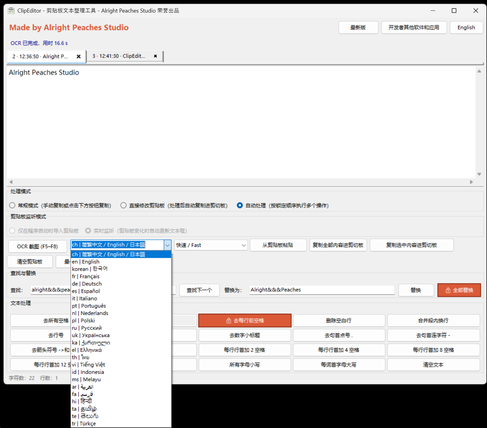
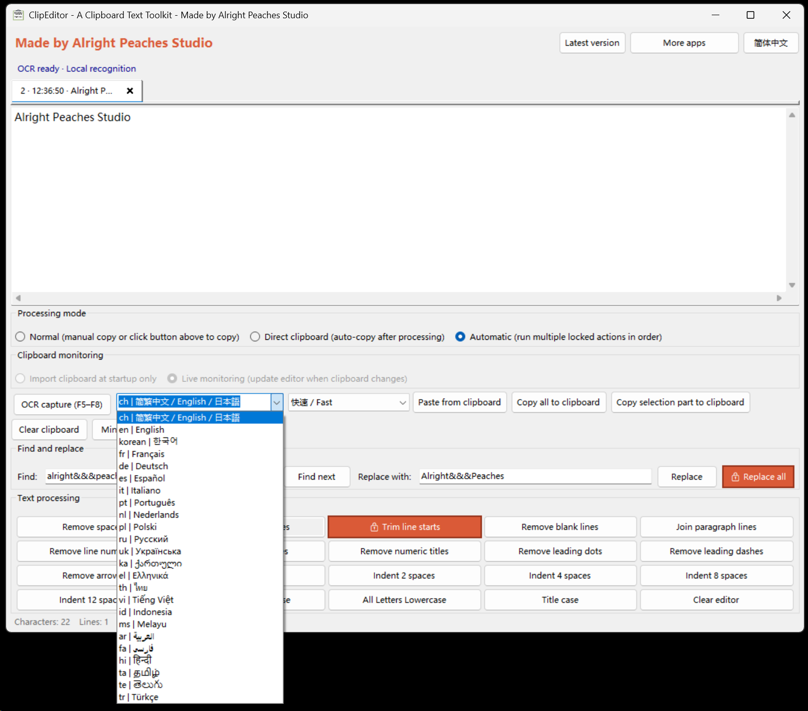

# ClipEditor

## 简体中文简介



**Windows 剪贴板文本处理与本地截图识字工具 · A Windows Clipboard Text Processor with Local Screenshot OCR**

Made by **Alright Peaches Studio**

[English Introduction](#english)

[开发者Alright Peaches Studio的其它软件和应用](https://store.steampowered.com/search/?l=schinese&term=Alright+Peaches+Studio)

### 软件简介

ClipEditor 是使用 C# 和 Windows Forms 开发的 Windows 桌面工具，可提取剪贴板纯文本、识别截图和剪贴板图片中的文字，并在粘贴前完成编辑、替换与格式整理。文字识别使用本地 PaddleOCR 引擎，完整发行包无需客户安装 Python。

从 Word、PDF、ChatGPT 网页或其他网站复制内容时，剪贴板中往往同时包含文字和富文本格式。直接粘贴到其他应用中，可能会带入不需要的字体、字号、颜色、背景或其他样式。ClipEditor 读取其中的文本内容，让你先检查和整理，再将结果以纯文本形式复制回剪贴板，方便粘贴到目标应用中。

除了去除富文本样式，ClipEditor 还提供截图 OCR、多语言图片识字、缩进、空格与换行整理、列表前缀清理、查找替换及临时历史标签等功能。也可以锁定常用处理步骤，让新复制的文字或图片识别结果按顺序自动整理并写回剪贴板，减少重复操作。

例如，你从 ChatGPT 复制了一段代码，需要将它嵌入现有代码块，并在每行前额外增加四个空格。与其逐行手动输入，只需将内容载入 ClipEditor，点击“每行行首加 4 空格”，再复制结果即可。

> 纯文本提取去除的是剪贴板中的富文本样式，不会自动删除文字本身包含的 Markdown 标记，例如 `**`、`#` 或代码围栏，也不会自动检查代码语法。

### 快速上手

1. **处理文字**：复制一段内容，点击“从剪贴板导入”，在文本框检查或修改，然后使用替换、空格、换行或缩进工具，最后复制结果。
2. **识别屏幕文字**：让 ClipEditor 窗口处于活动状态，点击左侧 OCR 截图按钮，或按 `F5`、`F6`、`F7`、`F8` 中任意一个键，拖动框选文字区域。按 `Esc` 或右键可取消框选。
3. **识别其他软件的截图**：将截图以图片数据放入剪贴板，再手动导入；开启实时监听后会自动识别，文字显示到编辑区并写回剪贴板。
4. **重复同一处理流程**：选择自动处理模式，按需要的执行顺序锁定“全部替换”、删除空白行等工具，再复制文字或截图。程序会完成处理并将最终结果送回剪贴板。

OCR 默认使用快速模式。识别其他语言时选择相应的 OCR 语言；需要对比识别效果时切换高精度模式。识别过程中可以查看阶段和耗时，也可以取消任务。

### 主要功能与适用场景

#### 1. 富文本转为纯文本

**设计初衷：让复制来的内容适应目标应用，而不是把来源应用的样式一起带过去。**

适合以下场景：

- 从 Word 复制段落，但不希望带入原文的字体、字号、颜色或背景。
- 从 ChatGPT 网页复制回答，需要将文字粘贴到自己的文档、表单或编辑器中。
- 从多个网站收集资料，希望最终内容采用目标文档统一的样式。
- 复制代码或配置片段，只需要文本，不需要网页的显示格式。

将内容导入 ClipEditor 后，点击“复制全部内容”或“复制选中内容”，即可将文本重新写入剪贴板。纯文本粘贴后的外观仍由目标应用决定。

手动导入普通文本本身不会将系统剪贴板改写为纯文本；需要主动复制，或执行相应的处理操作。自动处理模式会对监听到的内容执行锁定流程。剪贴板图片经 OCR 成功提取文字后，会将文字写回剪贴板，替换原图片。

#### 2. 可编辑文本框与内容统计

**设计初衷：在正式粘贴前，提供一个可以检查和手动修订内容的中间区域。**

可以直接新增文字、删除多余内容、修改代码或调整段落，而不必先打开另一款编辑器。

字符数和行数统计有助于检查内容长度，例如确认文字是否满足表单的字符限制，或比较整理换行前后的文本结构。

主文本框不设置固定的字符数量上限，但实际容量和响应速度仍受内存、文本长度及历史标签数量影响。

#### 3. 剪贴板操作

| 功能 | 设计初衷与典型场景 |
| --- | --- |
| 从剪贴板导入 | 按自己的节奏读取文本或识别剪贴板图片。适合关闭实时监听后，避免外部复制操作打断编辑。 |
| 复制全部内容 | 将完整结果以纯文本形式写入剪贴板。适合把整理完成的回答、文档或代码一次性粘贴到目标位置。 |
| 复制选中内容 | 只复制当前选中的文字。适合从 ChatGPT 的长回答中提取一个段落、几句话或一段代码。 |
| 清空剪贴板 | 主动移除当前系统剪贴板内容，减少后续误粘贴的可能。它不等于安全擦除，也不保证清除 Windows 剪贴板历史。 |

开启实时监听后，可使用 Windows 截图工具、`PrtSc` 或其他截图软件，将截图以**图片数据**放入系统剪贴板。ClipEditor 检测到图片后会进行识别，显示识别文字，并将文字写回剪贴板，随后可在目标应用中直接粘贴。

`PrtSc` 的具体行为取决于 Windows 和截图工具设置；需要先完成截图并确保图片已经进入剪贴板。仅复制图片文件的路径或文件对象，不等同于复制图片数据。

不使用实时监听时，可以通过原有的剪贴板导入按钮手动导入图片进行识别。启动时的剪贴板导入同样可以处理已有图片。

#### 4. 截图 OCR 与屏幕文字提取

**设计初衷：将无法直接选中的屏幕文字转为可以编辑、查找、替换和复制的文本。**

适合提取软件界面、网页图片、扫描文档当前显示区域中的文字。

- 点击左侧的 OCR 截图按钮，拖动鼠标框选需要识别的屏幕区域。
- ClipEditor 窗口处于活动状态时，按 `F5`、`F6`、`F7` 或 `F8` 均可启动同一个截图功能。
- 四个按键的作用相同，不分别对应不同语言或识别模式。
- 框选时按 `Esc` 或点击鼠标右键，可取消截图。
- 完成框选后，程序调用本地 OCR 引擎识别，并将文字载入文本框和临时历史标签。

这些是窗口内快捷键，程序不将它们注册为系统全局快捷键。如果其他软件的全局快捷键拦截了某个按键，可使用另外一个按键，或直接点击截图按钮。

OCR 输出为纯文本，不会恢复原图片的完整排版。选择清晰、完整的文字区域有助于识别；代码、数字和重要内容应核对后使用。

#### 5. OCR 语言与识别速度

OCR 语言与软件界面语言分别设置。可以保持中文界面，同时选择英文、韩文或其他已打包语言进行识别；OCR 语言选择会被记住。

常用语言包覆盖简体中文、繁体中文、英语、日语、韩语、法语、德语、西班牙语、意大利语、葡萄牙语、荷兰语、波兰语、俄语、乌克兰语、格鲁吉亚语、希腊语、泰语、越南语、印度尼西亚语、马来语、阿拉伯语、波斯语、印地语、泰米尔语、泰卢固语和土耳其语。

默认的中文组合用于简繁中文、英文和日文内容。处理其他语言时，请在 OCR 语言框选择对应语言。多个语言可以共用一套识别模型；包含多语言模型不表示程序会对每张图片依次运行所有语言，也不等于自动判断任意语言。实际可用范围以完整发行包中包含的模型为准。

- **快速**：默认选项，使用较轻量的检测模型；默认中文组合也使用轻量识别模型，适合日常屏幕截图。
- **高精度**：使用该语言配置的另一套模型组合，可用于与快速模式对比识别效果，通常需要更多计算资源。

识别引擎在首次任务时启动，完成后保持运行，供后续任务复用。程序最多缓存两套最近使用的模型组合，共用模型的语言可以复用同一个引擎实例，减少重复加载。

首次识别仍需要准备缓存、启动引擎并加载模型，可能比后续识别慢。切换到未缓存的模型、取消任务后重新识别或重启软件，也可能再次加载。常驻引擎会保留一定内存；实际耗时取决于电脑配置、图片尺寸、文字数量及所选模型，不保证固定耗时或高精度模式对每张图片都更准确。

#### 6. OCR 进度、取消与结果保护

识别期间，界面会显示“正在启动本地引擎”“正在加载模型”或“正在识别”等阶段，以及已用时间、滚动进度条和取消按钮。滚动进度条表示任务仍在运行，不代表精确完成百分比。

- 点击取消，可终止当前 OCR 任务；下一次识别会重新启动引擎。
- 识别完成、未识别到文字、失败或取消后，状态区域会保留相应提示。
- 未识别到文字时保留原内容，不用空结果覆盖编辑区。
- 如果识别完成时发现剪贴板、编辑文字、历史标签、处理模式或锁定的自动处理步骤已经变化，会丢弃过期结果，避免覆盖较新的内容。
- 关闭 ClipEditor 时，会结束其启动的常驻 OCR 引擎。

#### 7. 空格与换行整理

| 功能 | 设计初衷与典型场景 |
| --- | --- |
| 去所有空格 | 批量移除普通空格。适合整理夹杂多余空格的编号、标识符或短字符串。 |
| 去空格和换行 | 将分散在多行中的内容拼接成连续字符串，减少逐行合并的工作。 |
| 去每行前空格 | 清理复制内容中不需要的行首空白，让文本重新对齐，或为后续添加统一缩进做准备。 |
| 删除空白行 | 清除复制后出现的多余空行，减少无意义的垂直间距。 |
| 合并段内换行 | 将复制后被拆成多行的段落重新连接，使用空白行区分段落。 |

注意：

- “去所有空格”针对普通空格，不应理解为删除所有 Unicode 空白字符。
- 空格和空行可能属于正文结构或代码语法，不应不加检查地删除。
- 对 Python 等依赖缩进的代码，去掉行首空白可能破坏代码结构。
- 合并段内换行不会自动理解文章或代码，应检查处理结果。

#### 8. 列表前缀与符号清理

**设计初衷：清理复制展示内容时一起带来的编号、前缀和提示符，保留真正需要的正文。**

| 功能 | 典型场景与范围 |
| --- | --- |
| 去行号 | 复制出的文本或代码带有受支持的行号形式，而目标位置只需要正文。 |
| 去常见小标题或列表前缀 | ChatGPT 回答或文档以括号编号等常见前缀组织，需要减少逐条删除前缀的工作。 |
| 去数字小标题 | 批量清理程序支持的数字小标题形式。 |
| 去句首点号 | 各行开头出现不需要的点号，需要统一清理。 |
| 去句首连字符 | 将以连字符开头的列表转换为不带该标记的文本。 |
| 去箭头符号 | 不需要示意关系或提示符中的 `->`、`>>>` 等受支持符号，只希望保留文字。 |

这些功能只处理程序支持的形式，不是通用语法分析器。“小标题”不表示能够自动识别和删除所有自然语言标题。

连字符可能属于负数或命令参数，箭头符号也可能是有效代码。处理代码和重要数据前，请保留原始副本。

#### 9. 行号与字母大小写转换

| 功能 | 设计初衷与典型场景 |
| --- | --- |
| 添加行号 | 在讨论、审阅或教学中引用具体某一行，让别人更容易定位内容。 |
| 所有字母大写 | 按目标格式要求统一字母大小写，例如整理标签或短文本。 |
| 所有字母小写 | 批量统一为小写，减少逐个修改的工作。 |
| 每词首字母大写 | 对英文标题、名称或短语进行快速的词首字母大小写转换。 |

大小写转换不会判断品牌写法、缩写或标题语法。代码、网址、密码及其他区分大小写的内容不应随意转换。

#### 10. 行首增加 2、4、8 或 12 个空格

**设计初衷：快速调整整段文本的嵌入层级，避免逐行手动增加缩进。**

典型场景包括：

- 从 ChatGPT 复制代码后，将整段代码放入现有函数或代码块。
- 让复制来的内容整体向右额外缩进四个空格。
- 编写 Markdown 文档时，为一段文本增加缩进。
- 将说明、示例或配置片段嵌入已有的缩进结构。

点击对应按钮后，程序在每个非空行前额外添加指定数量的普通空格，保留原有缩进，空行保持为空。

例如，原始代码：

```python
def greet():
    print("Hello")
```

执行“每行行首加 4 空格”后：

```python
    def greet():
        print("Hello")
```

这是整体增加缩进，不是将所有行强制调整为四个空格。重复执行会继续增加空格，程序不会自动判断代码应该属于哪个层级。

#### 11. 独立查找与全部替换

**查找下一个：先定位内容，而不必修改它。**

适合在较长的 ChatGPT 回答、文档或代码中寻找关键词、变量名或特定文字。输入查找内容后，点击按钮，或在查找框中按 `Enter`。

**替换：只修改当前匹配项。**

如果主文本框中已经选中了与查找内容匹配的文字，点击“替换”只修改该匹配项；如果当前没有选中有效匹配项，程序会先定位当前位置之后最先出现的匹配项，再使用对应内容替换。适合逐项检查后决定是否修改，而不是一次更改全文。

**全部替换：一次处理重复出现的内容，减少遗漏和重复劳动。**

适合统一修改名称、替换重复用词，或批量删除固定文字。替换内容可以为空，用于删除匹配内容。

当前查找与替换使用区分大小写的精确文本匹配，不支持正则表达式，也不会区分代码中的变量、注释和字符串。

**使用 `&&&` 设置多组查找与替换规则**

查找、替换和全部替换支持使用 `&&&` 分隔多组内容。各查找项与相同位置的替换项一一对应。

例如：

- 查找：`张三&&&李四`
- 替换为：`王五&&&赵六`

对应关系为：

- `张三` → `王五`
- `李四` → `赵六`

“查找下一个”会选择当前位置之后最先出现的任一查找项；“替换”会修改当前选中的匹配项，或自动查找并替换接下来最先出现的一项；“全部替换”则处理全文中的所有对应内容。

全部替换以原文为基础同时应用各组规则。前一组产生的结果不会被后一组再次替换，避免出现连锁替换。

为了让空格在说明中可见，下面用 `␠` 表示一个真正的空格。实际输入时不要输入 `␠` 字符，而是在查找框最前面按一次空格键。

例如：

- 查找：`␠&&&111`
- 替换为：`d&&&`

这表示：

- 空格 → `d`
- `111` → 空内容，即删除 `111`

原文 `ABC 111 DEF` 执行全部替换后会变成 `ABCddDEF`：两个空格分别变成 `d`，`111` 被删除。

使用多组规则时需要注意：

- 查找项和替换项必须按照相同顺序一一对应。
- 两边的项目数量必须相同，否则程序会停止操作并显示提示。
- 查找项不能为空。
- 替换项可以为空；空项表示删除对应内容。
- 如果整个替换框为空，所有匹配到的查找项都会被删除。
- `&&&` 是多组内容的专用分隔符。

#### 12. 临时历史标签

**设计初衷：方便在一次工作过程中比较和切换多次载入的内容，而不是建立长期剪贴板数据库。**

例如，连续从 ChatGPT 复制几个版本的回答或代码后，可以通过标签回看上一版，不必返回网页重新寻找和复制。

- 新载入的剪贴板文本及成功接收的 OCR 文字会建立标签，之前的内容仍可访问。
- 点击标签，将对应内容显示到主文本框，不自动复制到剪贴板。
- 编辑当前文本框，也会更新当前标签中的内容；标签不是不可修改的快照。
- 点击右侧的 `×` 可以删除记录，关闭区域与切换区域分离。
- 当前最多保留 **20 个标签**，超过上限时移除最早的记录。
- 删除最后一个标签后，会创建一个空白标签供继续编辑。
- 历史仅在本次进程内存中保留，不写入历史文件或注册表，退出后不恢复。

历史标签用于临时查阅，不应作为重要内容的唯一备份。

#### 13. 中英文界面与设置记忆

**设计初衷：让用户选择熟悉的界面语言，并减少每次启动后的重复设置。**

支持简体中文与英文切换。界面语言、处理模式、剪贴板监听模式及 OCR 语言通过当前用户的注册表设置保存，下次启动时恢复上次选择。OCR 语言与界面语言分别选择；快速/高精度选项在启动时默认为快速。

这一设置机制不用于保存文本或历史标签内容。

#### 14. 换行兼容与窗口操作

- 支持 Windows 的 CRLF、Linux/macOS 的 LF、旧式 Mac 的 CR，以及部分 Unicode 换行字符；载入显示时统一为 Windows 换行。
- 文本框随窗口大小占用工具区域上方的剩余空间，较长文本通过滚动条查看。
- 窗体尺寸受当前屏幕工作区限制。
- 可在布局面板、分组框空白处和普通说明文字上按住左键移动窗口。
- 文本框、按钮、单选按钮和历史标签保留正常操作，不作为拖动区域，也没有 Alt 拖动操作。
- 提供最小化和退出按钮，方便在编辑与其他应用之间切换。

> 本软件是 Windows 应用。支持 Linux/macOS 的文本换行格式，不代表可以直接在 Linux/macOS 上运行。

### 各个模式的设计初衷

处理模式决定文本整理和内部截图识别后如何处理结果，监听模式决定是否自动导入后续剪贴板内容。两者通常互相独立。剪贴板图片识别成功后，在各处理模式下都会将识别文字写回剪贴板；自动处理模式写回的是执行锁定步骤后的最终文字。

> 自动处理模式是例外：选择该模式时会自动启用实时监听，并暂时锁定监听模式选项，以便对新复制的文字立即执行已锁定操作。

#### 常规处理模式：先检查，再决定复制什么

适合需要逐步处理、比较结果或手动修改内容的情况。

执行文本处理操作或在 ClipEditor 内部截图识字后，结果留在文本框中，不自动覆盖剪贴板。可以继续调整，最后选择复制全部或只复制选中内容。导入或监听到的剪贴板图片则会在识别成功后用文字替换原图片，方便直接粘贴。

例如，从 Word 复制段落后，先去掉多余空行，再修改几句话，确认完成后才复制到目标文档。

#### 直接修改剪贴板模式：减少处理后的重复复制操作

适合明确知道需要执行什么处理，希望快速完成“导入 → 处理 → 粘贴”的情况。

执行文本整理、替换操作或完成 OCR 识别后，程序自动将完整结果写回剪贴板，无需再点击“复制全部”。

例如，从 ChatGPT 复制代码，点击“每行行首加 4 空格”，随后即可去目标编辑器粘贴。

此模式不会在每次键盘输入时自动同步，也不会仅因导入普通文本或切换历史标签就自动写回剪贴板。只需要转为纯文本、不执行其他处理时，可以使用“复制全部”。

清空文本的处理操作在此模式下也可能同步清空剪贴板。

#### 自动处理模式：复制后按锁定顺序完成一组固定操作

适合需要反复复制不同文本、连续截图识字，并对每段内容执行相同处理流程的情况。收到图片时先进行 OCR，再按锁定顺序处理识别文字；没有锁定步骤时，直接显示并复制识别文字。

进入自动处理模式后，可以点击“全部替换”或文本处理区域中的按钮进行锁定：

- 第一次点击某个按钮，将它加入自动处理步骤，并显示锁定状态。
- 再次点击同一按钮，将它从自动处理步骤中解锁。
- 可以同时锁定多个按钮，程序按照锁定的先后顺序依次执行，每个步骤只执行一次。
- 全部步骤完成后，程序只把最终结果写回剪贴板一次，随后可直接在目标应用中粘贴。
- 切换回常规模式或直接修改剪贴板模式时，当前锁定步骤会被清除。

例如，先锁定“全部替换”，再锁定“去所有空格”，新复制的文字会先执行替换，再删除空格，最后将完整结果写回剪贴板。

锁定“全部替换”时，程序保存当时填写的查找和替换规则，包括 `&&&` 多组规则以及空替换项。锁定后修改输入框不会悄悄改变已锁定规则；如需更新规则，应先点击“全部替换”解锁，再使用新内容重新锁定。

#### 仅启动时导入模式：保持当前编辑内容稳定

适合把 ClipEditor 当作临时编辑器使用。

启动时读取一次剪贴板中的文本或识别其中的图片，之后即使在其他应用中复制了新内容，也不会自动导入。需要处理下一段文本或下一张图片时，再点击导入按钮；内部 OCR 截图按钮仍可随时使用。

设计重点是避免外部复制操作打断当前编辑过程。

#### 实时监听模式：连续处理多次复制的内容

适合频繁从 Word、ChatGPT 或网页复制不同段落，希望省去每次手动导入操作的情况。

剪贴板变化时，程序会自动导入文本；如果是图片数据，则交给 OCR 识别，并将成功识别的文字显示、写回剪贴板。两类文字都可以通过临时历史标签回看。剪贴板清空或变为既非文本也非可识别图片的内容时，编辑区会清空。图片未识别到文字时保留原内容，并显示提示。

设计重点是提高连续处理效率。但外部剪贴板变化可能切换当前显示内容，因此进行较长的手动编辑时，更适合使用“仅启动时导入”。

#### 如何组合两类模式

普通文本的常用组合如下：

| 组合 | 适合的工作方式 |
| --- | --- |
| 常规处理＋仅启动时导入 | 专心检查和编辑一段内容，完成后手动复制。 |
| 直接修改剪贴板＋仅启动时导入 | 稳定处理当前内容，执行操作后即可去目标应用粘贴。 |
| 常规处理＋实时监听 | 连续导入不同内容，但由自己决定何时、复制哪些结果。 |
| 直接修改剪贴板＋实时监听 | 连续复制、快速处理、直接粘贴，减少导入和复制按钮操作。 |

对于普通文本，实时监听与直接修改剪贴板组合并不等于复制后立即自动转换并写回纯文本；导入后仍需执行处理操作或主动复制。剪贴板图片识别成功后则会自动写回文字。

OCR 的结果去向如下：

| 处理模式 | ClipEditor 内部截图 | 导入或监听到的剪贴板图片 |
| --- | --- | --- |
| 常规处理 | 识别文字进入文本框和历史标签；检查后手动复制。 | 识别文字进入文本框和历史标签，并写回剪贴板，替换原图片。 |
| 直接修改剪贴板 | 识别文字显示在编辑区，并自动写回剪贴板。 | 识别文字显示在编辑区，并自动写回剪贴板。 |
| 自动处理 | 识别后按锁定顺序执行文本处理步骤，将最终结果显示并写回剪贴板。 | 收到图片后先识别，再执行锁定步骤，将最终结果显示并写回剪贴板。 |

> 文本处理按钮通常作用于整个主文本框。“复制选中内容”只限定复制范围，不代表其他处理按钮只处理选中的文字。

### 下载与运行

1. 打开本仓库的 **Releases** 页面。
2. 如果已有可执行版本，下载对应的 Windows 发行压缩包，而不是 GitHub 自动生成的 `Source code (zip)`。
3. 解压所有文件，运行其中的 `ClipEditor.exe`，并保留发行包附带的依赖和配置文件。
4. 安装该版本发行说明要求的 .NET 或 .NET Framework 运行环境（如果需要）。

**客户不需要安装 Python。** OCR 功能需要主程序旁边的完整 `PaddleOCR` 文件夹，不能只复制其中一个 EXE。

| 相对 `ClipEditor.exe` 的路径 | 用途 |
| --- | --- |
| `PaddleOCR/ClipEditorOCR.exe` | 本地 OCR 引擎。 |
| `PaddleOCR/_internal/` | 引擎附带的运行时和依赖，需完整保留。 |
| `PaddleOCR/model_cache/` | 随发行包提供的语言模型，需完整保留。 |
| `PaddleOCR/model_manifest.json` | 语言及快速/高精度模型映射，需保留。 |
| `PaddleOCR/build-versions.txt` | 构建依赖版本记录，建议保留以便排错。 |

截图识别在本机执行，不需要将图片上传到在线 OCR 服务。完整模型随发行包提供后可离线识别；运行时缺少模型会显示错误，需要补齐完整发行包。首次运行可能将随包模型复制到可写缓存目录，因此还需要相应的磁盘空间。

若尚未提供可执行发行包，请按照下方步骤从源码编译。

具体运行环境和处理器架构以项目文件及各版本的发行说明为准，不能只根据 Visual Studio 版本推断。

### 从源码编译

开发工具：**Visual Studio Community 2022**。项目开发过程中使用的版本为 **17.13.5**，但不表示必须使用完全相同的 IDE 版本。

1. 克隆本仓库，或下载完整源码并解压。
2. 在 Visual Studio Installer 中安装 **“.NET 桌面开发”**工作负载。
3. 用 Visual Studio 打开仓库中的 `.sln` 解决方案。
4. 检查项目属性中的目标框架；如有缺失，安装对应的 .NET SDK 或 .NET Framework 目标包/Developer Pack。
5. 如果项目有 NuGet 依赖，先还原 NuGet 包。
6. 将构建配置切换为 **Release**，选择项目支持的处理器平台。
7. 执行 **生成 → 重新生成解决方案**。
8. 使用完整生成输出；如果使用“发布”功能，则以发布目录为准。

源码应包含 `.sln`、`.csproj`、`.cs`、`.resx` 以及项目引用的资源，不应只包含代码粘贴文本。

如果需要构建 OCR 功能，还需运行源码包中的 `PaddleOCR/build_ocr_exe.cmd`。该脚本使用 Python 3.10 x64 准备依赖和语言模型，并生成独立 OCR 引擎。等待 `BUILD AND FROZEN SELF-TEST PASSED` 后，将生成的整个 `dist/ClipEditorOCR` 文件夹改名为 `PaddleOCR`，放到主程序旁。构建阶段需要联网；客户不需要安装 Python，也不需要开发者的 `.venv` 文件夹。更新常驻 OCR 协议时，应同时重新生成主程序和 OCR 引擎。

发布前，请在独立文件夹中测试，最好再在未安装 Visual Studio 和 Python 的 Windows 环境中验证。不要假设只复制一个 EXE 就包含全部运行依赖。

### 设置与隐私

界面语言、处理模式、监听模式和 OCR 语言保存在当前用户的注册表位置：

```text
HKEY_CURRENT_USER\Software\Alright Peaches Studio\ClipEditor
```

设置值包括 `UiLanguage`、`ProcessingMode`、`ClipboardWatchMode` 和 `OcrLanguage`。这些设置不用于保存文本或历史标签内容。

文本处理和 OCR 识别在本机进行，不提供文本上传或云端历史功能，也不需要将截图上传到在线 OCR 服务。OCR 会使用本地临时图片文件，并可能将模型复制到可写缓存目录；这与文本历史仅保存在内存中的机制不同。点击“开发者其他软件和应用”会调用默认浏览器打开下方 Steam 页面；浏览器和 Steam 有各自的数据处理规则。

该按钮的实际地址随界面语言变化：简体中文界面打开 Steam 简体中文搜索页面，英文界面打开原英文搜索页面。“最新版”按钮则调用默认浏览器打开 ClipEditor 的 GitHub 页面。

注意：

- 剪贴板可能包含密码、身份信息或其他敏感内容，开启实时监听前请了解这一行为。
- 直接修改剪贴板模式和自动处理模式会写回处理结果；剪贴板图片识别成功后也会被文字替换，包括在常规模式下。
- 临时历史不是备份，删除标签、超过标签上限或退出程序可能导致内容无法从本软件中恢复。
- 不提供安全擦除保证；不保存历史文件不意味着敏感数据绝不可能存在于系统剪贴板历史、分页文件或其他软件中。
- 处理重要文档、代码或数据前，请保留原始副本并检查结果。

### 问题反馈与贡献

欢迎通过本仓库的 **Issues** 报告问题，或通过 **Pull Requests** 提交改进。

报告问题时，请提供 Windows 版本、显示缩放比例、软件版本、所选模式、复现步骤，以及不包含隐私信息的示例文本或图片。OCR 问题还请注明识别语言、快速/高精度选项和状态区提示。

请勿在公开 Issue、截图或日志中提交真实密码、密钥或敏感剪贴板内容。

### 作者与其他应用

**Made by Alright Peaches Studio**

[开发者Alright Peaches Studio的其它软件和应用](https://store.steampowered.com/search/?l=schinese&term=Alright+Peaches+Studio)

[查看 ClipEditor 最新版](https://github.com/AlrightPeachesStudio/ClipEditor)

### 许可证

本项目采用 **MIT License**，完整条款见 [LICENSE](LICENSE)。

允许使用、修改、分发和商业使用；分发软件副本或代码的重要部分时，应保留版权及许可声明。软件按原样提供，不作任何担保。第三方组件和资源如附带独立许可证，应遵守其各自条款。

## English

[简体中文简介](#简体中文简介)

[More apps from the developer - Alright Peaches Studio](https://store.steampowered.com/search?term=Alright+Peaches+Studio)



### About ClipEditor

ClipEditor is a Windows desktop application built with C# and Windows Forms for extracting clipboard text, recognizing text in screenshots and clipboard images, and editing or processing the results before pasting them elsewhere. OCR uses a local PaddleOCR engine; customers using the complete release package do not need Python installed.

Content copied from Word, PDF, ChatGPT webpages, and other websites can include rich-text formatting alongside the text itself. Pasting it directly may bring unwanted fonts, sizes, colors, backgrounds, or other styles into your destination document.

ClipEditor reads the text representation, lets you inspect and prepare it, and writes the result back as plain text when you copy it. The destination application determines how the pasted plain text appears.

It provides multilingual screenshot OCR, indentation, whitespace and line-break cleanup, supported list-prefix removal, find and replace, and temporary history tabs. Lock frequently used operations to automatically process newly copied text or recognized image text in sequence and write the result back to the clipboard.

For example, if code copied from ChatGPT needs four additional spaces at the beginning of each line before being inserted into an existing code block, you can apply the indentation operation instead of editing every line manually.

> Plain-text extraction removes rich-text clipboard formatting. It does not automatically remove literal Markdown characters such as `**`, `#`, or code fences, and it does not validate code syntax.

### Quick start

1. **Process text:** copy some text, import it, review or edit it, apply replacement or cleanup tools, then copy the result.
2. **Recognize screen text:** activate ClipEditor, click the OCR screenshot button or press any of `F5`, `F6`, `F7`, or `F8`, then drag to select a region. Press `Esc` or right-click to cancel selection.
3. **Recognize another application's screenshot:** place image data on the clipboard and import it manually, or enable live monitoring to recognize it automatically. The text appears in the editor and replaces the clipboard image.
4. **Repeat a workflow:** select Automatic processing, lock tools such as Replace all and Remove blank lines in the required order, then copy text or take screenshots. ClipEditor processes the content and copies the final result.

OCR starts with the Fast profile. Select the OCR language for your content and try High accuracy when you want to compare results. During recognition, view the current stage and elapsed time or cancel the task.

### Features and practical use cases

#### 1. Rich text to plain text

**Purpose: keep the text you need without carrying the source application's styling into the destination.**

Useful when:

- Copying Word paragraphs without their original font, size, color, or background.
- Moving ChatGPT answers into your own document, form, or editor.
- Collecting text from multiple websites while keeping the destination document's styling consistent.
- Copying code or configuration snippets without webpage formatting.

Import the content, then use **Copy all** or **Copy selection** to write plain text to the clipboard.

Manually importing ordinary text does not itself rewrite the clipboard. Copy the result or perform a processing operation as appropriate. Automatic mode runs the locked workflow on monitored content. Successful clipboard-image OCR writes recognized text back, replacing the image.

#### 2. Editable text area and statistics

**Purpose: provide an intermediate workspace for checking and revising content before pasting.**

Add text, remove unwanted sections, adjust wording, or edit code without opening another editor. Character and line counts help check length limits and changes to the text structure.

There is no fixed editor character limit, but large text and multiple history entries can consume memory and reduce responsiveness.

#### 3. Clipboard operations

| Function | Purpose and typical use |
| --- | --- |
| Import clipboard content | Load text or recognize a clipboard image when you are ready, particularly when live monitoring is disabled. |
| Copy all | Copy the complete prepared document, answer, or code snippet as plain text. |
| Copy selection | Extract only a paragraph, a few sentences, or a code block from longer content. |
| Clear clipboard | Remove current clipboard contents to reduce accidental pasting. This is not secure erasure and does not guarantee removal from Windows clipboard history. |

With live monitoring enabled, use Windows capture tools, `PrtSc`, or another screenshot application to place **image data** on the clipboard. ClipEditor recognizes the image, displays the text, and writes the text back to the clipboard, ready to paste elsewhere.

The behavior of `PrtSc` depends on Windows and screenshot-tool settings. Finish the capture and ensure the image reaches the clipboard. Copying an image file object or its path is not the same as copying image data.

Without live monitoring, use the existing clipboard import button to recognize an image manually. Startup clipboard import can also recognize an image already on the clipboard.

#### 4. Screenshot OCR and screen text extraction

**Purpose: turn text that cannot be selected directly into editable, searchable, replaceable, and copyable text.**

Use it for application interfaces, webpage images, or the visible area of a scanned document.

- Click the OCR screenshot button on the left and drag to select a screen region.
- While ClipEditor is the active window, press `F5`, `F6`, `F7`, or `F8` to start the same capture function.
- All four keys perform the same action; they do not select different languages or recognition profiles.
- Press `Esc` or right-click during selection to cancel the capture.
- After selection, the local engine recognizes the image and loads its text into the editor and temporary history.

ClipEditor does not register these keys as system-wide hotkeys. If another application's global hotkey intercepts one of them, use another listed key or click the screenshot button.

OCR produces plain text rather than reconstructing the full original layout. Capture clear, complete text regions and review important text, numbers, and code before using them.

#### 5. OCR languages and recognition speed

The OCR language is separate from the interface language, and the selected OCR language is remembered. For example, keep the interface in Chinese while recognizing English or Korean text.

The common language package covers Simplified Chinese, Traditional Chinese, English, Japanese, Korean, French, German, Spanish, Italian, Portuguese, Dutch, Polish, Russian, Ukrainian, Georgian, Greek, Thai, Vietnamese, Indonesian, Malay, Arabic, Persian, Hindi, Tamil, Telugu, and Turkish.

The default Chinese combination is intended for Simplified/Traditional Chinese, English, and Japanese content. Select the corresponding OCR language for other text. Several languages may share a recognition model. Bundling multiple languages does not mean running every language model on every image or automatically identifying any language. Availability depends on the models included in the complete release package.

- **Fast** is the default. It uses a lighter detection model and a lighter recognizer for the default Chinese combination, suitable for everyday screenshots.
- **High accuracy** uses the alternative model combination configured for the selected language. Compare its results with Fast when needed; it generally requires more computation.

The engine starts for the first task and stays running for later requests. Up to two recently used model combinations are cached, and languages sharing the same models can reuse one engine instance.

The first recognition still involves cache preparation, engine startup, and model loading. Selecting an uncached model, retrying after cancellation, or restarting the application can require loading again. Keeping the engine running uses memory. Timing depends on hardware, image size, text density, and model choice; neither a fixed processing time nor better results on every image are guaranteed.

#### 6. OCR status, cancellation, and result protection

During OCR, the interface shows stages such as starting the local engine, loading models, and recognizing text, together with elapsed time, an animated progress indicator, and a Cancel button. The animation indicates activity, not an exact completion percentage.

- Cancel stops the current task; the next recognition restarts the engine.
- Completion, no-text, failure, and cancellation messages remain visible in the status area.
- A no-text result preserves existing content rather than replacing the editor with an empty result.
- Results are discarded if the clipboard, editor text, selected history tab, processing mode, or locked automatic workflow has changed by completion, helping preserve newer content.
- Closing ClipEditor terminates the resident OCR engine it started.

#### 7. Spaces and line breaks

| Function | Purpose and typical use |
| --- | --- |
| Remove spaces | Remove ordinary spaces from identifiers, numbers, or short strings that contain unwanted spacing. |
| Remove spaces and line breaks | Join content split across multiple lines into one continuous string. |
| Trim line starts | Remove unwanted leading whitespace or prepare text for new indentation. |
| Remove blank lines | Reduce excessive vertical spacing introduced during copying. |
| Join paragraph lines | Reconnect paragraphs broken into multiple lines, using blank lines as paragraph boundaries. |

“Remove spaces” should not be interpreted as removing every kind of Unicode whitespace.

Spaces, blank lines, and indentation can be meaningful. In indentation-sensitive languages such as Python, trimming line starts can break code structure. Paragraph joining does not understand document or code semantics; review the result.

#### 8. List prefixes and symbols

**Purpose: remove supported numbering, prefixes, or prompts that were copied along with displayed content.**

| Function | Purpose and typical use |
| --- | --- |
| Remove line numbers | Keep the text or code without supported line-number prefixes. |
| Remove common list prefixes | Clean supported numbering and bracketed prefixes from answers or documents. |
| Remove numeric titles | Remove supported numeric-title forms in bulk. |
| Remove leading dots | Clean unwanted dots at line starts. |
| Remove leading dashes | Convert dash-prefixed lists into text without that marker. |
| Remove arrows | Remove supported symbols such as `->` and `>>>` when only the surrounding text is needed. |

These functions recognize supported forms, not every possible heading or list format. They are not general-purpose parsers.

Dashes may be part of negative numbers or command arguments, and arrows may be valid code. Keep originals before applying these operations to code or important data.

#### 9. Line numbers and capitalization

| Function | Purpose and typical use |
| --- | --- |
| Add line numbers | Make specific lines easier to reference in reviews, discussions, or teaching. |
| Uppercase | Convert letters for a required label or text format. |
| Lowercase | Normalize letter case without editing each occurrence manually. |
| Capitalize word initials | Quickly change word-initial capitalization in names, short phrases, or headings. |

Case conversion does not understand brand names, acronyms, or title grammar. Avoid applying it indiscriminately to case-sensitive code, URLs, passwords, or data.

#### 10. Add 2, 4, 8, or 12 leading spaces

**Purpose: shift a complete text block to an additional indentation level without editing every line.**

Useful for:

- Inserting code copied from ChatGPT into an existing function or code block.
- Adding four extra spaces to an entire snippet.
- Indenting text in Markdown documents.
- Embedding examples or configuration snippets into an existing structure.

The selected number of ordinary spaces is added to every non-empty line. Existing indentation is preserved, and empty lines remain empty.

This adds indentation; it does not reset every line to the selected width. Repeating the operation adds more spaces. The application does not infer the correct code nesting level.

#### 11. Independent find and replace

**Find next** locates content without modifying it. Use the button or press `Enter` in the search field to find keywords, variable names, or specific text.

**Replace** changes only the current match. If valid matching text is already selected in the editor, that match is replaced. If no valid match is selected, the application finds the earliest matching item after the current position and replaces it with the corresponding value. This supports reviewing and changing matches one at a time.

**Replace all** changes repeated text in one operation. An empty replacement deletes matches.

Matching is case-sensitive and literal, not regular-expression based. The application does not distinguish variables from comments or string literals.

**Using `&&&` for multiple find and replacement rules**

Find, Replace, and Replace All support multiple items separated by `&&&`. Each find item is paired with the replacement item in the same position.

For example:

- Find: `cat&&&111`
- Replace with: `dog&&&000`

The corresponding rules are:

- `cat` → `dog`
- `111` → `000`

Find next selects whichever find item appears first after the current position. Replace changes the currently selected match, or finds and replaces the next earliest item. Replace all processes every corresponding occurrence throughout the text.

Replace All applies every rule to the original text simultaneously. Text produced by one rule is not processed again by another rule, preventing unintended chained replacements.

In the following example, `␠` visually represents one real space. Do not type the `␠` character. Instead, press the Space key once at the beginning of the Find box.

For example:

- Find: `␠&&&111`
- Replace with: `d&&&`

This creates two rules:

- Space → `d`
- `111` → empty text, which deletes `111`

After Replace All, `ABC 111 DEF` becomes `ABCddDEF`: both spaces become `d`, while `111` is deleted.

When using multiple rules:

- Find and replacement items must correspond in the same order.
- Both sides must contain the same number of items, or the application stops and displays a message.
- Find items cannot be empty.
- Replacement items may be empty; an empty item deletes the corresponding match.
- If the entire Replace box is empty, every matched find item is deleted.
- `&&&` is the reserved separator for multiple items.

#### 12. Temporary history tabs

**Purpose: revisit and compare content during one working session rather than maintain a permanent clipboard database.**

Useful when copying several versions of a ChatGPT answer or code snippet and wanting to return to an earlier one.

- Newly imported clipboard text and accepted OCR results receive a tab.
- Selecting a tab displays its text without automatically copying it.
- Editing the text also updates the selected entry; tabs are not immutable snapshots.
- Use the tab's `×` button to delete it. Closing and switching areas are separate.
- At most **20 tabs** are retained; the oldest entry is removed when necessary.
- Deleting the last tab creates a new empty editing tab.
- History exists only in application memory and is not restored after exit.

Temporary history is not a backup.

#### 13. Languages and remembered preferences

**Purpose: use a familiar interface without repeating setup at every launch.**

Switch between Simplified Chinese and English. The interface language, processing mode, monitoring mode, and OCR language are remembered through current-user registry settings. OCR language is selected independently from interface language; the recognition profile defaults to Fast at startup.

This mechanism does not save editor text or history entries.

#### 14. Line endings and window behavior

- Normalize Windows CRLF, Linux/macOS LF, legacy Mac CR, and supported Unicode line separators for Windows display.
- The editor fills the remaining area above the processing controls and uses scrollbars for longer text.
- Window dimensions are constrained by the current screen's working area.
- Drag the window with the left mouse button from layout backgrounds, group-box backgrounds, and ordinary labels.
- Text fields, buttons, radio buttons, and history tabs retain their normal interaction and are not drag surfaces. There is no Alt-drag operation.
- Minimize and exit buttons support switching between ClipEditor and other applications.

> Supporting Linux/macOS line endings does not make this a Linux/macOS application. The current application is Windows-only.

### Modes and their design goals

Processing settings control how text operations and internal screenshot results are handled. Monitoring settings control whether later clipboard content is imported automatically. These settings are usually independent. Successful clipboard-image OCR writes text back in every processing mode; Automatic mode writes the final text after its locked steps.

> Automatic processing is the exception: selecting it enables live monitoring and temporarily locks the monitoring choices so newly copied text can immediately run through the locked actions.

#### Normal processing: inspect first, copy when ready

Use this mode for step-by-step cleanup, manual editing, or checking results before replacing clipboard contents.

Text-processing results and OCR results from captures inside ClipEditor stay in the editor. Copy the complete result or a selection when you are satisfied. Imported or monitored clipboard images are an exception: successful OCR replaces the clipboard image with text, ready to paste.

Example: import a Word paragraph, remove unnecessary blank lines, revise the wording, then copy it to your destination document.

#### Direct clipboard processing: fewer steps after processing

Use this mode when you know the required operation and want a quick import → process → paste workflow.

Text-processing operations, replacements, and completed OCR tasks automatically write the complete result to the clipboard.

Example: copy code from ChatGPT, add four leading spaces, then paste directly into your editor without clicking Copy all.

This mode does not synchronize every keystroke. Importing text or selecting a history tab does not automatically rewrite the clipboard. For plain-text conversion without another operation, use Copy all.

Clearing the editor through a processing operation can also clear the clipboard in this mode.

#### Automatic processing: run a locked workflow after every copy

Use this mode when repeatedly copying text or recognizing screenshots that should follow the same processing workflow. Images are recognized first, then the locked actions run in order. With no actions locked, recognized text is displayed and copied directly.

In Automatic mode, click **Replace all** or any button in the text-processing area to lock or unlock it:

- The first click adds that button to the automatic workflow and displays its locked state.
- Clicking the same button again removes it from the workflow.
- Multiple buttons can be locked together. They run once each in the order in which they were locked.
- After all steps finish, only the final result is written back to the clipboard, ready to paste into the destination application.
- Switching to Normal or Direct clipboard mode clears the current locked workflow.

For example, lock **Replace all** first and **Remove spaces** second. Each newly copied text is replaced first, then has its spaces removed, and the final result is written back to the clipboard.

When **Replace all** is locked, the application stores the Find and Replace rules entered at that moment, including multiple `&&&` rules and empty replacement items. Later edits to the input boxes do not silently change the locked rule. Unlock Replace all and lock it again to use updated values.

#### Startup-only import: keep editing stable

The application imports text or recognizes a clipboard image once at startup and does not automatically import later changes. The internal OCR screenshot button remains available.

Use it as a temporary editor without having your current content switched by copying something in another application. Import the next text item or image manually when ready.

#### Live monitoring: process repeated copying efficiently

Use this mode when repeatedly copying content from Word, ChatGPT, or webpages.

Clipboard changes import text or send image data to OCR. Successfully recognized text is displayed and written back to the clipboard. Both kinds of text use temporary history tabs. Empty clipboard content, or content containing neither text nor a supported image, clears the editor. A no-text OCR result preserves existing content and displays a message.

External clipboard changes can switch the displayed entry. For longer uninterrupted manual editing, choose startup-only import.

#### Combining the settings

Common combinations for ordinary text:

| Combination | Suggested workflow |
| --- | --- |
| Normal + startup-only | Carefully edit one item, then copy manually. |
| Direct + startup-only | Keep the current item stable and paste immediately after processing. |
| Normal + live monitoring | Import successive items automatically while deciding what and when to copy. |
| Direct + live monitoring | Repeatedly copy, process, and paste with fewer import and copy-button actions. |

For ordinary text, live monitoring combined with direct processing is not an automatic plain-text clipboard passthrough: after import, perform an operation or explicitly copy the text. Successful clipboard-image recognition automatically writes its text back.

OCR results are handled as follows:

| Processing mode | Capture inside ClipEditor | Import or monitor a clipboard image |
| --- | --- | --- |
| Normal | Load recognized text into the editor and history; copy manually after reviewing. | Load recognized text into the editor and history, and replace the clipboard image with text. |
| Direct clipboard | Display recognized text and automatically write it to the clipboard. | Display recognized text and automatically write it to the clipboard. |
| Automatic | Recognize, run locked text-processing steps in order, then display and copy the final result. | Recognize the incoming image, run locked steps in order, then display and copy the final result. |

> Processing buttons generally operate on the entire editor. Copy selection limits the copying scope, not the scope of other processing operations.

### Download and run

1. Open this repository's **Releases** page.
2. If available, download the Windows release package, not GitHub's automatically generated `Source code (zip)`.
3. Extract the complete package and run `ClipEditor.exe`, keeping dependencies and configuration files together.
4. Install the runtime specified by that release, if required.

**Customers do not need Python installed.** Keep the complete `PaddleOCR` folder beside `ClipEditor.exe`.

| Path relative to `ClipEditor.exe` | Purpose |
| --- | --- |
| `PaddleOCR/ClipEditorOCR.exe` | Local OCR engine. |
| `PaddleOCR/_internal/` | Bundled runtime and dependencies; keep the entire folder. |
| `PaddleOCR/model_cache/` | Bundled language models; keep the entire folder. |
| `PaddleOCR/model_manifest.json` | Required language and recognition-profile mapping. |
| `PaddleOCR/build-versions.txt` | Build dependency versions; recommended for troubleshooting. |

Recognition runs locally without uploading screenshots to an online OCR service. A complete release containing the required models can recognize text offline. Missing runtime models produce an error and require restoring the complete package. Initial use may copy bundled models into a writable cache, requiring additional disk space.

If no executable release is available, build from source.

The actual .NET or .NET Framework requirement and processor architecture are defined by the project configuration and release notes, not by the Visual Studio version alone.

### Build from source

Development tool: **Visual Studio Community 2022**. Version **17.13.5** was used during development; an exact IDE-version match is not itself a runtime requirement.

1. Clone the repository or extract the complete source archive.
2. Install the **.NET desktop development** workload through Visual Studio Installer.
3. Open the repository's `.sln` solution.
4. Check the target framework and install the corresponding SDK or .NET Framework targeting/Developer Pack if needed.
5. Restore NuGet packages if the project uses them.
6. Select **Release** and a supported processor platform.
7. Rebuild the solution.
8. Use the complete build output, or the publish output when publishing through Visual Studio.

The source distribution should include the solution, project files, C# files, `.resx` files, and referenced resources—not only pasted code text.

To build OCR, also run `PaddleOCR/build_ocr_exe.cmd` from the source package. It uses Python 3.10 x64 to prepare dependencies and language models and build the OCR executable. Wait for `BUILD AND FROZEN SELF-TEST PASSED`, then copy the entire generated `dist/ClipEditorOCR` folder beside the main application and rename it to `PaddleOCR`. Building requires internet access; customers do not need Python or the developer's `.venv` folder. Rebuild both the main application and OCR engine when updating the resident OCR protocol.

Test release packages outside the development output folder and preferably on Windows without Visual Studio or Python installed. Do not assume the EXE alone includes all required dependencies.

### Preferences and privacy

Preferences are stored under the current user's registry key:

```text
HKEY_CURRENT_USER\Software\Alright Peaches Studio\ClipEditor
```

Values include `UiLanguage`, `ProcessingMode`, `ClipboardWatchMode`, and `OcrLanguage`. These settings do not store editor text or history entries.

Text processing and OCR run locally without text uploads or cloud history, and screenshots do not need to be uploaded to an online OCR service. OCR uses local temporary image files and may copy models into a writable cache; this is separate from the in-memory text history. The developer-apps button opens the Steam page linked below in your default browser; the browser and Steam handle data under their own rules.

The actual developer-apps URL follows the interface language: Simplified Chinese opens the Simplified Chinese Steam search page, while English keeps the original English search page. The Latest version button opens the ClipEditor GitHub page in the default browser.

Please remember:

- Clipboard content may contain passwords or personal information, especially during live monitoring.
- Direct and Automatic processing write results back to the clipboard. Successful clipboard-image OCR also replaces the image with text, including in Normal mode.
- Deleting entries, exceeding the history limit, or exiting the application can remove access to text held by this app.
- No secure-erasure guarantee is provided. Text may still exist in Windows clipboard history, paging files, or other applications.
- Keep original copies of important documents, code, or data and review transformation results.

### Feedback and contributions

Use this repository's **Issues** to report problems and **Pull Requests** to propose improvements.

Include the Windows version, display scaling, application version, selected modes, reproduction steps, and a sanitized text or image sample. For OCR issues, also include the recognition language, Fast/High accuracy selection, and status message.

Do not post real passwords, keys, or private clipboard content in public reports, screenshots, or logs.

### Developer

**Made by Alright Peaches Studio**

[More apps from the developer - Alright Peaches Studio](https://store.steampowered.com/search?term=Alright+Peaches+Studio)

[View the latest ClipEditor version](https://github.com/AlrightPeachesStudio/ClipEditor)

### License

This project uses the **MIT License**. See [LICENSE](LICENSE) for the full terms.

Use, modification, distribution, and commercial use are permitted, subject to retaining the required copyright and permission notices. The software is provided without warranty. Third-party components and resources with separate licenses remain subject to those licenses.
